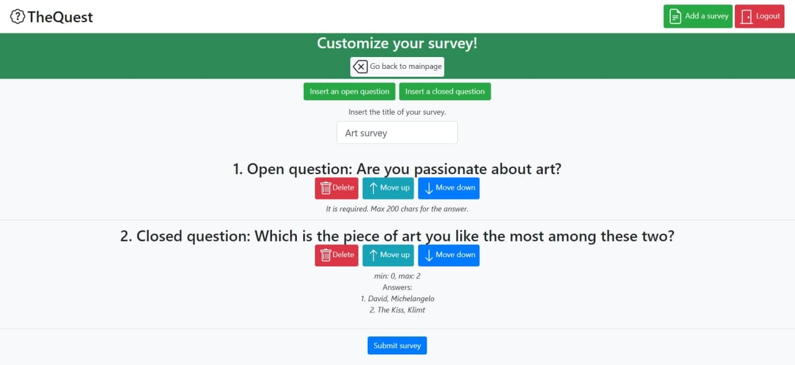

# Exam #1: "Survey"
## Student: s286329 Lisciandrello Mattia

## React Client Application Routes

- Route `/admin`: Main page of an administrator, which contains all the surveys made by him and the option to view the submissions made for a certain survey (if there are any). The navbar is now updated and contains the link to `/insert`, along with the possibility to log out
- Route `/insert`: Page used by an administrator to insert a new survey and new open/closed questions. Contains also the Modal used to insert the questions datas.
- Route `/`: Main page of an user which is not logged in. Offers the possibility to log in and to make a submission for a certain survey.

## API Server

- GET `/api/surveys`
  - Retrieves all the surveys, even from different admins. It's used for a non-logged in user.
  - request parameters and request body content: //
  - response body content: 
    -	surveys = [{ 
        - `id`: id of the survey, 
        - `title`: title of the survey,
        - `adminName`: name of the admin that made the survey}, {...}]; 
- GET `/api/surveys/admin`
  - Retrieves all the surveys for a given admin
  - request parameters and request body content: No sensible data is sent, the id of the logged user is retrieved by the back-end
  - response body content:
    - surveys = ([{
      - `id`: id of the survey, 
      - `title`: title of the survey,
      - `adminName`: name of the admin that made the survey,
      - `n_submissions`: number of submissions for each survey}, {...}]); 
- GET `/api/surveys/id=:id`
  - Retrieves a survey by it's id and the questions/answers related to it
  - request parameters and request body content: id of the survey, passed as a parameter
  - response body content:
    - survey = [{
      - `id`: id of the question,
      - `question`: text containing the question, 
      - `min`: min in a closed question, null in an open question, 
      - `max`: max of options checkable in a closed question, max number of characters in an open question, 
      - `open`: 0 if it's a closed question, 1 otherwise, 
      - `required`: null in a closed question, 0 or 1 in an open one, 
      - `options`: [{...}],}, {...}]; 
    -  Options is made as such: {
       - `index`:,
       - `id`:, 
       - `id_option`:,
       - `option_text`:}

- GET `/api/answers/id=:id`
  - Retrieves all the answer sheets for a specific survey
  - request parameters and request body content: id of the survey, passed as a parameter
  - response body content:
    - answers = [{
      - `id`: id of the answer, 
      - `ref_as`: ref of the answer sheet, 
      - `answer_text`: text containing the answer of the user, 
      - `ref_q`: ref to the question, 
      - `name`: name of the user that submitted an answer sheet, 
      - `ref_s`: ref of the survey, 
      - `ref_op`: ref of the option, if it's a closed question
      },{...}]

- POST `/api/surveys`
  - Insert a survey for a given admin
  - request parameters and request body content: 
    - {`title`: title of the survey, `questions`: [{...}]}. 
    - A question is made as such:{
      - `question`: the value of the question, 
      - `min`: min in a closed question, null in an open question,
      - `max`: max of options checkable in a closed question, max number of characters in an open question,
      - `answers`: [...],
      - `open`: 0 if it's a closed question, 1 otherwise, 
      - `required`: null in a closed question, 0 or 1 in an open one,
				}; 
      
      Answers contains all the possible options for a closed question.
  - response body content: A status which tells if the operation was completed correctly

- POST `/api/surveys/submit`
  - Submit a survey made by an user
  - request parameters and request body content: 
    - A json made as such: {
        - `answers`: [{…}],
        - `survey`: {...},
        - `name`: name of the user,});
      
          - Answers = [{
             - `id_question`: id of the question, 
             - `answer`: value of the answer,
             - `open`:  0 if it's a closed question, 1 otherwise, 
             - `index`: index of the answer
           },{...}]. 
          
          - If it's an answer for a closed question = [{ 
            - `id_question`:, 
            - `ref_op`: ref of the option, 
            - `answer`:,
            - `open`:},{...}]
          - Survey = {`id`:, `title`:, `adminName`:}
  - response body content: A status which tells if the operation was completed correctly

- POST `/api/login`
  - Send the credentials in order to log in
  - request parameters and request body content: A JSON containing email and password
  - response body content: A json containing the user data

- DELETE `/api/login/current`
  - If the user is logged in, it logs him out
  - request parameters and request body content: //
  - response body content: A status which tells if the operation was completed correctly

- GET `/api/login/current`
  - Retrieves the information regarding a logged in user
  - request parameters and request body content: //
  - response body content: A json containing the user data

## Database Tables

- Table `admin` - contains [id, email, name, password]. The purpouse of the table is to store every admin of the system.
  - `id`: Id of the admin
  - `email`: Email of the admin, used for the login
  - `name`: Name of admin, showed on the screen after a login
  - `password`: Crypted password of the admin through bcrypt
- Table `survey` - contains [id, ref_a, title]. The purpouse of the table is to store every survey, each one related to a certain admin.
  - `id`: Id of the survey
  - `ref_a`: Reference of the admin id that made a given survey
  - `title`: Title of the given survey
- Table `question` - contains [id, ref_s, question, min, max, open, required, position]. The purpouse of the table is to store every question, each one related to a certain survey.
  - `id`: Id of the question
  - `ref_s`: Reference of the survey id which contains the given question
  - `question`: Containts the text of the question
  - `min`: Minimum number of answers checkable for a closed question. It's null for an open question.
  - `max`: Maximum number of answers checkable for a closed question. For an open question, it's the maximum number of chars to insert.
  - `open`: 0 if the question is closed, 1 if it's open.
  - `required`: Used only for open questions, otherwise min/max are used to express required questions. 1 if required, 0 otherwise.
  - `position`: Represent the position in the order in the survey: it's used to order them when a survey is presented to the user.
- Table `option` - contains [id, ref_q, option_text]. The purpouse of the table is to store every option regarding a closed question.
  - `id`: Id of the option
  - `ref_q`: Reference of the question id
  - `option_text`: Contains the text of the option
- Table `answer` - contains [id, ref_q, answer_text, ref_as, ref_op]. The purpouse of the table is to store every answer regarding a certain question, for each answer sheet. It's used to save the answers made by an user and show them to an admin.
  - `id`: Id of the answer
  - `answer_text`: Contains the text of the answer. In the case of a closed questions, contains the value of the checkbox.
  - `ref_as`: Reference to the answer sheet id which contains the answers inserted.
  - `ref_op`: Reference to the option id, if it's a closed question.
- Table `answer_sheet` - contains [id, name, ref_s]. The purpouse of the table is to store the submissions made by an user.
  - `id`: Id of the answer sheet.
  - `name`: Name of the user that submitted the answers.
  - `ref_s`: Reference to the survey id.

## Main React Components

- `SurveyRow` (in `SurveyRow.js`): shows how a Survey is rendered inside a `SurveyContainer.js`. It contains also the API call to get all the info regarding a survey, which are called when the button near a certain survey is pressed (If the user is logged in, it will fetch also the answer sheets related to a certain survey. After fetching it, the response from the back-end will be processed and setted as a state).
- `ModalInsertSurvey` (in `ModalInsertSurvey.js`): contains all the states regarding a specific question and handles the insertion of a specific question. It contains both the return methods for an open and a closed question.
- `InsertSurveyRow` (in `InsertSurveyRow.js`): shows how a question is rendered inside `InsertSurvey.js`. It contains also the methods to order a question (move up/move down) and to delete it.
- `ModalAnswerSheet` (in `ModalAnswerSheet.js`): handle the submission for a specific survey / shows the data regarding all the submissions that an admin received on one of his surveys.
- `AnswerSheetRow` (in `AnswerSheetRow.js`): renders all the questions for a specific survey and handles the state for each one of them, by managing an answer array state. 
- `API.js` (in `API.js`): contains all the API calls and the methods that communicate with the backend.
- `App.js` (in `APP.js`): handles the login/logout/checks if a user is logged in, uses API methods to get the surveys/the surveys for a specific admin and contains all the routes, while also rendering the main pages both for loggend and not-logged users.

(only _main_ components, minor ones may be skipped)

## Screenshot

## Users Credentials

- email: s286329@studenti.polito.it, name: Mario Rossi, password: esameMattia
  - Made "Chocolate survey" and "Art survey"
- email: mattia@polito.it, name: Mattia, password: pistacchio 
  - Made "Survey about pizza"
